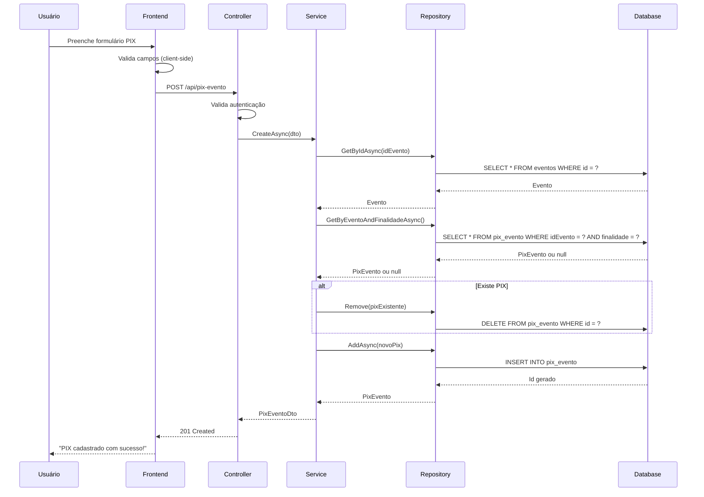

# User Story: Cadastro de PIX para Eventos

**ID:** US-001  
**Título:** Cadastro de PIX para Eventos  
**Status:** Implementado  
**Versão:** 2.0

---

## 1. Objetivo

**Como** organizador de evento,  
**Eu quero** cadastrar PIX com diferentes finalidades (Presentes, Ingressos, Geral),  
**Para que** meus convidados possam fazer pagamentos de forma prática através de QR Code.

---

## 2. Contexto

Organizadores de eventos precisam receber pagamentos dos convidados para:
- **Presentes** (casamentos, aniversários, chá de bebê)
- **Ingressos** (festas, shows, eventos pagos)
- **Contribuições Gerais** (rateios, despesas coletivas)

O sistema permite cadastrar um PIX por finalidade. O organizador informa o código QR Code PIX gerado pelo banco, e o sistema o disponibiliza para os convidados escanearem.

---

## 3. Regras de Negócio

1. **Um PIX por finalidade**: Cada evento pode ter apenas 1 PIX para cada finalidade (Presentes, Ingressos ou Geral)
2. **Substituição automática**: Ao cadastrar novo PIX para finalidade já existente, o anterior é substituído
3. **Finalidade imutável**: Não é possível alterar a finalidade após cadastro (deve criar novo)
4. **Exclusão permanente**: Não há histórico de PIX antigos

---

## 4. Critérios de Aceitação

### Cadastro
- ✓ Organizador pode cadastrar PIX informando: Código QR Code PIX e Nome do Beneficiário
- ✓ Sistema valida se código PIX é válido (formato correto)
- ✓ Sistema exibe mensagem de sucesso após cadastro
- ✓ Se já existe PIX para aquela finalidade, o anterior é substituído automaticamente

### Edição
- ✓ Organizador pode editar Nome do Beneficiário e Código PIX
- ✓ Não pode alterar a Finalidade (Presentes, Ingressos, Geral)

### Exclusão
- ✓ Organizador pode excluir PIX do evento
- ✓ Sistema solicita confirmação antes de excluir

### Consulta
- ✓ Organizador visualiza todos os PIX do evento
- ✓ Sistema identifica qual finalidade está cadastrada

---

## 5. Fluxos Principais

### 5.1. Cadastrar PIX
1. Organizador acessa configurações do evento
2. Seleciona finalidade (Presentes, Ingressos ou Geral)
3. Cola código PIX gerado no app do banco
4. Informa nome do beneficiário
5. Salva
6. Sistema confirma cadastro ou substituição

### 5.2. Editar PIX
1. Organizador acessa PIX cadastrado
2. Edita nome do beneficiário ou código PIX
3. Salva alterações
4. Sistema confirma atualização

### 5.3. Excluir PIX
1. Organizador seleciona PIX para excluir
2. Sistema pede confirmação
3. Organizador confirma
4. Sistema remove PIX

---

## 6. Validações

| Campo | Regra |
|-------|-------|
| Código PIX | Obrigatório, máx. 1000 caracteres, deve iniciar com "00020" |
| Nome Beneficiário | Obrigatório, máx. 200 caracteres |
| Finalidade | Obrigatória, valores: Presentes, Ingressos ou Geral |

---

## 7. Mensagens do Sistema

| Situação | Mensagem |
|----------|----------|
| Sucesso no cadastro | "PIX cadastrado com sucesso!" |
| Sucesso na edição | "PIX atualizado com sucesso!" |
| Sucesso na exclusão | "PIX excluído com sucesso!" |
| Código PIX inválido | "Código PIX inválido. Verifique o formato." |
| Campo obrigatório vazio | "O campo [nome] é obrigatório." |
| PIX não encontrado | "PIX não encontrado para esta finalidade." |

---

## 8. Melhorias Futuras

- Geração automática de QR Code visual (imagem)
- Validação completa do código PIX com checksum
- Auditoria de alterações
- Estatísticas de visualizações do QR Code

---

## 9. Histórico de Versões

| Versão | Data | Descrição |
|--------|------|-----------|
| 1.0 | 07/01/2026 | Versão inicial |
| 2.0 | 08/01/2026 | Modelo simplificado - foco em payload PIX |
| 2.1 | 10/01/2026 | Versão enxuta focada em negócio |

#### 5.3.1. Validação de QR Code PIX

- **Formato:** 
  - Deve começar com "00020"
  - Máximo 1000 caracteres
  - Mensagem de erro: "O código QR Code PIX deve começar com '00020'"
  - Mensagem de erro: "O código QR Code PIX deve ter no máximo 1000 caracteres"

#### 5.3.2. Validação de Campos Obrigatórios

- Campos marcados com `*` devem ser preenchidos
- Mostrar borda vermelha em campos vazios ao tentar salvar
- Exibir mensagem específica abaixo do campo inválido

#### 5.3.3. Validação de Tamanho

- **Nome Beneficiário:** máximo 200 caracteres
- **QR Code PIX:** máximo 1000 caracteres
- Exibir contador de caracteres restantes nos campos de texto longo

### 5.4. Mensagens de Feedback

#### 5.4.1. Mensagens de Sucesso (Toast verde, 3 segundos)

- "PIX cadastrado com sucesso!"
- "PIX atualizado com sucesso!"
- "PIX excluído com sucesso!"

#### 5.4.2. Mensagens de Erro (Toast vermelho, 5 segundos)

- "O evento é obrigatório."
- "O nome do beneficiário é obrigatório."
- "O nome do beneficiário deve ter no máximo 200 caracteres."
- "O código QR Code PIX é obrigatório."
- "O código QR Code PIX deve ter no máximo 1000 caracteres."
- "O código QR Code PIX deve começar com '00020'."
- "Evento não encontrado."
- "PIX não encontrado."
- "ID do PIX não corresponde ao informado na requisição."

#### 5.4.3. Mensagens de Aviso (Toast amarelo)

- "Ao salvar este PIX, o PIX anterior para a mesma finalidade será **substituído permanentemente**."

### 5.5. Responsividade

#### 5.5.1. Desktop (>= 1024px)
- Modal centralizado com largura fixa de 600px
- Campos lado a lado quando apropriado
- Botões alinhados à direita

#### 5.5.2. Tablet (768px - 1023px)
- Modal com largura de 90% da tela
- Todos os campos em coluna única
- Botões ocupando largura total

#### 5.5.3. Mobile (< 768px)
- Tela completa (não modal)
- Campos ocupando 100% da largura
- Botões empilhados verticalmente
- Tamanho de fonte aumentado para facilitar digitação

### 5.6. Estados da UI

#### 5.6.1. Estado Inicial
- Todos os campos vazios
- Botão "Salvar" habilitado
- Foco no primeiro campo (Finalidade)

#### 5.6.2. Estado de Carregamento
- Overlay semi-transparente sobre o formulário
- Spinner de carregamento
- Botões desabilitados
- Texto: "Salvando PIX..."

#### 5.6.3. Estado de Edição
- Campos preenchidos com dados existentes
- Título muda para "Editar PIX"
- Botão muda para "Atualizar"
- Apenas Nome Beneficiário e QR Code PIX são editáveis

#### 5.6.4. Estado de Erro
- Campo inválido com borda vermelha
- Mensagem de erro abaixo do campo
- Scroll automático para o primeiro erro
- Foco no campo com erro

### 5.7. Acessibilidade

- Todos os campos com labels visíveis
- Atributo `aria-required="true"` em campos obrigatórios
- Atributo `aria-invalid="true"` em campos com erro
- Mensagens de erro com `role="alert"`
- Navegação por teclado (Tab/Shift+Tab)
- Suporte a leitores de tela
- Contraste mínimo de 4.5:1 para textos

---

## 6. Regras de Negócio

### RN-001: Unicidade de PIX por Finalidade
**Descrição:** Apenas um PIX pode existir por finalidade por evento (garantido por índice único no banco de dados).

**Comportamento:**
- Ao cadastrar novo PIX, o sistema verifica se já existe PIX para a mesma finalidade
- Se existir, o PIX anterior é automaticamente **deletado permanentemente**
- O novo PIX é salvo no lugar do anterior
- Não há histórico de PIX desativados

**Índice único:** (IdEvento, Finalidade)

---

### RN-002: Validação de Formato do Payload PIX
**Descrição:** O código QR Code PIX deve estar no formato válido do padrão PIX do Banco Central.

**Regras:**
- Deve começar com "00020" (Payload Format Indicator)
- Máximo 1000 caracteres
- É o código completo copia e cola gerado pelo banco

**Comportamento:** Se a validação falhar, retornar erro: "O código QR Code PIX deve começar com '00020'."

**Observação:** O QRCodePix é o código completo (payload) gerado pelo banco que contém todas as informações necessárias da transação, incluindo a chave PIX, nome do beneficiário (embedded), dados do pagamento, etc.

---

### RN-003: Substituição Permanente
**Descrição:** PIX substituídos são excluídos permanentemente, sem manutenção de histórico.

**Comportamento:**
- Ao criar novo PIX para finalidade existente, o anterior é deletado (hard delete)
- Não há conceito de PIX "ativo" ou "inativo"
- Exclusão física ocorre automaticamente na substituição ou via endpoint DELETE explícito

**Benefício:** Simplifica o modelo e evita confusão com múltiplos PIX

---

### RN-004: Vinculação ao Evento
**Descrição:** Todo PIX deve estar vinculado a um evento existente.

**Comportamento:**
- Ao cadastrar PIX, o sistema valida se o IdEvento existe
- Se evento não existir, retornar erro: "Evento não encontrado."
- Não é possível cadastrar PIX sem IdEvento válido

**Validação:** Verificação no banco de dados antes de salvar

---

### RN-005: Campos Obrigatórios
**Descrição:** Todos os campos do formulário são obrigatórios para cadastro.

**Campos Obrigatórios:**
- IdEvento
- Finalidade
- NomeBeneficiario
- QRCodePix

**Comportamento:** Requisição é rejeitada se qualquer campo estiver vazio ou nulo

---

### RN-006: Limites de Caracteres
**Descrição:** Campos de texto possuem limite de caracteres para garantir integridade do banco.

**Limites:**
- NomeBeneficiario: 200 caracteres
- QRCodePix: 1000 caracteres

**Comportamento:** Retornar erro se limite for excedido

---

### RN-007: Registro de Data de Cadastro
**Descrição:** Todo PIX cadastrado registra a data de criação.

**Comportamento:**
- DataCadastro = data/hora atual (UTC) no momento do cadastro
- DataCadastro nunca é alterada após criação

---

### RN-008: Permissões de Acesso
**Descrição:** Usuário deve ter permissão para gerenciar PIX do evento.

**Validações:**
- Usuário deve estar autenticado (token JWT válido)
- Usuário deve ser organizador ou ter permissão de edição no evento
- Tentativa sem autenticação retorna 401 Unauthorized
- Tentativa sem permissão retorna 403 Forbidden

---

## 7. Endpoints da API

### Base URL
```
https://api.eventhub.com/api/pix-evento
```

### Autenticação
Todos os endpoints requerem autenticação via Bearer Token no header:
```
Authorization: Bearer {token}
```

---

### 7.1. Criar PIX

**Endpoint:** `POST /api/pix-evento`

**Descrição:** Cadastra novo PIX para um evento (substitui PIX existente se houver para mesma finalidade).

**Request Body:**
```json
{
  "idEvento": 1,
  "finalidade": 1,
  "nomeBeneficiario": "João Silva",
  "qrCodePix": "00020126580014br.gov.bcb.pix01363690ADCE-4D39-AC5D-D86E5E36C8F30204000053039865802BR5913João Silva6009SAO PAULO62070503***6304A1B2"
}
```

**Parâmetros:**
| Campo | Tipo | Obrigatório | Descrição | Valores Possíveis |
|-------|------|-------------|-----------|-------------------|
| idEvento | int | Sim | ID do evento | > 0 |
| finalidade | int | Sim | Finalidade do PIX | 1=Presentes, 2=Ingressos, 3=Geral |
| nomeBeneficiario | string | Sim | Nome do titular da conta | Máx. 200 caracteres |
| qrCodePix | string | Sim | Código PIX copia e cola completo | Máx. 1000 caracteres, deve começar com "00020" |

**Response - 201 Created:**
```json
{
  "statusCode": 201,
  "message": "Sucesso",
  "data": {
    "id": 1,
    "idEvento": 1,
    "finalidade": 1,
    "finalidadeDescricao": "Presentes",
    "nomeBeneficiario": "João Silva",
    "qrCodePix": "00020126580014br.gov.bcb.pix...",
    "dataCadastro": "2026-01-08T14:30:00Z"
  }
}
```

**Response - 400 Bad Request:**
```json
{
  "statusCode": 400,
  "message": "O nome do beneficiário é obrigatório.",
  "data": null
}
```

**Response - 401 Unauthorized:**
```json
{
  "statusCode": 401,
  "message": "Token de autenticação inválido ou expirado.",
  "data": null
}
```

---

### 7.2. Atualizar PIX

**Endpoint:** `PUT /api/pix-evento/{id}`

**Descrição:** Atualiza dados de um PIX existente (apenas NomeBeneficiario e QRCodePix).

**URL Parameters:**
- `id` (int): ID do PIX a ser atualizado

**Request Body:**
```json
{
  "id": 1,
  "nomeBeneficiario": "João da Silva Santos",
  "qrCodePix": "00020126580014br.gov.bcb.pix..."
}
```

**Response - 200 OK:**
```json
{
  "statusCode": 200,
  "message": "Sucesso",
  "data": {
    "id": 1,
    "idEvento": 1,
    "finalidade": 1,
    "finalidadeDescricao": "Presentes",
    "nomeBeneficiario": "João da Silva Santos",
    "qrCodePix": "00020126580014br.gov.bcb.pix...",
    "dataCadastro": "2026-01-08T14:30:00Z"
  }
}
```

**Response - 400 Bad Request:**
```json
{
  "statusCode": 400,
  "message": "ID do PIX não corresponde ao informado na requisição.",
  "data": null
}
```

---

### 7.3. Excluir PIX

**Endpoint:** `DELETE /api/pix-evento/{id}`

**Descrição:** Remove permanentemente um PIX do banco de dados.

**URL Parameters:**
- `id` (int): ID do PIX a ser excluído

**Response - 200 OK:**
```json
{
  "statusCode": 200,
  "message": "PIX excluído com sucesso.",
  "data": "PIX excluído com sucesso."
}
```

**Response - 400 Bad Request:**
```json
{
  "statusCode": 400,
  "message": "PIX não encontrado.",
  "data": null
}
```

---

### 7.4. Buscar PIX por ID

**Endpoint:** `GET /api/pix-evento/{id}`

**Descrição:** Retorna dados de um PIX específico.

**URL Parameters:**
- `id` (int): ID do PIX

**Response - 200 OK:**
```json
{
  "statusCode": 200,
  "message": "Sucesso",
  "data": {
    "id": 1,
    "idEvento": 1,
    "finalidade": 1,
    "finalidadeDescricao": "Presentes",
    "nomeBeneficiario": "João Silva",
    "qrCodePix": "00020126580014br.gov.bcb.pix...",
    "dataCadastro": "2026-01-08T14:30:00Z"
  }
}
```

**Response - 404 Not Found:**
```json
{
  "statusCode": 404,
  "message": "PIX não encontrado.",
  "data": null
}
```

---

### 7.5. Listar PIX de um Evento

**Endpoint:** `GET /api/pix-evento/evento/{idEvento}`

**Descrição:** Lista todos os PIX de um evento.

**URL Parameters:**
- `idEvento` (int): ID do evento

**Response - 200 OK:**
```json
{
  "statusCode": 200,
  "message": "Sucesso",
  "data": [
    {
      "id": 1,
      "idEvento": 1,
      "finalidade": 1,
      "finalidadeDescricao": "Presentes",
      "nomeBeneficiario": "João Silva",
      "qrCodePix": "00020126580014br.gov.bcb.pix...",
      "dataCadastro": "2026-01-08T14:30:00Z"
    },
    {
      "id": 2,
      "idEvento": 1,
      "finalidade": 2,
      "finalidadeDescricao": "Ingressos",
      "nomeBeneficiario": "João Silva",
      "qrCodePix": "00020126580014br.gov.bcb.pix...",
      "dataCadastro": "2026-01-08T14:35:00Z"
    }
  ]
}
```

---

### 7.6. Buscar PIX por Evento e Finalidade

**Endpoint:** `GET /api/pix-evento/evento/{idEvento}/finalidade/{finalidade}`

**Descrição:** Retorna o PIX de um evento para uma finalidade específica (retorna único PIX).

**URL Parameters:**
- `idEvento` (int): ID do evento
- `finalidade` (int): Finalidade (1=Presentes, 2=Ingressos, 3=Geral)

**Response - 200 OK:**
```json
{
  "statusCode": 200,
  "message": "Sucesso",
  "data": {
    "id": 1,
    "idEvento": 1,
    "finalidade": 1,
    "finalidadeDescricao": "Presentes",
    "nomeBeneficiario": "João Silva",
    "qrCodePix": "00020126580014br.gov.bcb.pix...",
    "dataCadastro": "2026-01-08T14:30:00Z"
  }
}
```

**Response - 404 Not Found:**
```json
{
  "statusCode": 404,
  "message": "PIX não encontrado para esta finalidade.",
  "data": null
}
```

---

## 8. Modelo de Dados

### 8.1. Entidade: PixEvento

```csharp
public class PixEvento
{
    public int Id { get; set; }
    public int IdEvento { get; set; }
    public FinalidadePix Finalidade { get; set; }
    public string NomeBeneficiario { get; set; } = string.Empty;
    public string QRCodePix { get; set; } = string.Empty;
    public DateTime DataCadastro { get; set; }

    // Relacionamentos
    public Evento Evento { get; set; } = null!;
}
```

### 8.2. Enums

#### FinalidadePix
```csharp
public enum FinalidadePix
{
    Presentes = 1,
    Ingressos = 2,
    Geral = 3
}
```

### 8.3. Diagrama ER

```
┌─────────────────────────┐
│       Evento            │
├─────────────────────────┤
│ Id (PK)                 │
│ Nome                    │
│ ...                     │
└─────────────────────────┘
           │
           │ 1
           │
           │
           │ N
           ▼
┌─────────────────────────┐
│      PixEvento          │
├─────────────────────────┤
│ Id (PK)                 │
│ IdEvento (FK)           │
│ Finalidade              │
│ NomeBeneficiario        │
│ QRCodePix               │
│ DataCadastro            │
└─────────────────────────┘
```

**Relacionamento:** Um evento pode ter múltiplos PIX cadastrados, mas apenas um por finalidade (garantido por índice único).

---

## 9. Dependências

### 9.1. Técnicas

- **.NET 8.0** - Framework backend
- **Entity Framework Core** - ORM
- **FluentValidation** - Validações
- **AutoMapper** - Mapeamento de objetos
- **MySQL/PostgreSQL** - Banco de dados
- **JWT Authentication** - Autenticação

### 9.2. Funcionais

#### Pré-requisitos:
1. **Evento deve existir** - O evento ao qual o PIX será vinculado deve estar cadastrado no sistema
2. **Usuário autenticado** - Token JWT válido
3. **Permissões de acesso** - Usuário deve ter permissão para gerenciar o evento

#### Entidades Relacionadas:
- **Evento** - Relacionamento obrigatório (Foreign Key)
- **Usuário** - Para validação de permissões (não há FK direto, mas validação via token)

### 9.3. Integrações

#### Backend:
- `IPixEventoRepository` - Acesso a dados
- `IEventoRepository` - Validação de evento existente
- `IUnitOfWork` - Transações
- `PixEventoService` - Lógica de negócio
- `PixEventoValidation` - Validações

#### Frontend (futuro):
- Biblioteca de geração de QR Code visual
- Componentes de formulário
- Serviço de autenticação
- Serviço de API (HTTP client)

---

## 10. Testes

### 10.1. Testes Unitários

#### Service Layer:
- ✅ `CreateAsync_ComDadosValidos_DeveCriarPix()`
- ✅ `CreateAsync_ComEventoInexistente_DeveLancarExcecao()`
- ✅ `CreateAsync_ComPixExistente_DeveSubstituirAnterior()`
- ✅ `UpdateAsync_ComDadosValidos_DeveAtualizarPix()`
- ✅ `DeleteAsync_ComIdValido_DeveRemoverPix()`

#### Validation Layer:
- ✅ `ValidarQRCodePix_ComPayloadValido_DevePassar()`
- ✅ `ValidarQRCodePix_SemIniciarCom00020_DeveFalhar()`
- ✅ `ValidarQRCodePix_MuitoLongo_DeveFalhar()`
- ✅ `ValidarNomeBeneficiario_ComNomeValido_DevePassar()`
- ✅ `ValidarNomeBeneficiario_MuitoLongo_DeveFalhar()`

### 10.2. Testes de Integração

- ✅ `POST_PixEvento_ComDadosValidos_Retorna201()`
- ✅ `POST_PixEvento_SemAutenticacao_Retorna401()`
- ✅ `PUT_PixEvento_ComIdValido_Retorna200()`
- ✅ `DELETE_PixEvento_ComIdValido_Retorna200()`
- ✅ `GET_PixEvento_PorId_Retorna200()`
- ✅ `GET_PixEvento_PorEvento_RetornaLista()`

### 10.3. Testes E2E (Planejados)

- [ ] Fluxo completo de cadastro via UI
- [ ] Validação de campos em tempo real
- [ ] Substituição automática de PIX ativo
- [ ] Responsividade em diferentes dispositivos

---

## 11. Métricas de Sucesso

### 11.1. KPIs Técnicos
- **Taxa de Erro:** < 1% nas requisições de cadastro
- **Tempo de Resposta:** < 500ms para operações CRUD
- **Cobertura de Testes:** > 80%
- **Disponibilidade:** > 99.5%

### 11.2. KPIs de Negócio
- **Adoção:** % de eventos que cadastram PIX
- **Conversão:** Taxa de convidados que utilizam PIX cadastrado
- **Satisfação:** NPS de organizadores que usam funcionalidade

---

## 12. Melhorias Futuras

### 12.1. Prioridade Alta
- [ ] **Geração automática de QR Code visual** - Converter payload em imagem PNG/SVG
- [ ] **Validação completa de payload PIX** - Verificar se código é válido segundo padrão BACEN (checksum CRC16)
- [ ] **Preview do QR Code** - Mostrar QR Code antes de salvar
- [ ] **Parser de payload** - Extrair e exibir informações do payload (chave, nome, valor, etc)

### 12.2. Prioridade Média
- [ ] **Auditoria de alterações** - Log de criação/edição/exclusão de PIX
- [ ] **Estatísticas de uso** - Dashboard com métricas de acesso aos QR Codes
- [ ] **Notificações** - Alertar organizador quando PIX é visualizado
- [ ] **Backup automático** - Exportar configurações de PIX

### 12.3. Prioridade Baixa
- [ ] **Integração com APIs bancárias** - Validar chaves PIX em tempo real
- [ ] **Geração automática de payload** - Criar código PIX a partir dos dados
- [ ] **QR Code dinâmico** - PIX com valor pré-definido
- [ ] **Analytics** - Rastreamento de conversão e valores médios

---

## 13. Riscos e Mitigações

| Risco | Probabilidade | Impacto | Mitigação |
|-------|---------------|---------|-----------|
| Payload PIX inválido cadastrado | Média | Alto | Implementar validação de formato e CRC16 do payload PIX |
| Payload muito grande | Baixa | Baixo | Validação de tamanho máximo (1000 caracteres) |
| Perda de dados por exclusão acidental | Média | Alto | Implementar confirmação antes de substituir PIX existente |
| Payload corrompido no banco | Baixa | Médio | Usar encoding adequado (UTF-8) e validação antes de salvar |
| QR Code não gerando imagem | Média | Alto | Implementar fallback com texto do payload |

---

## 14. Documentação Relacionada

- [Especificação PIX - Banco Central](https://www.bcb.gov.br/content/estabilidadefinanceira/pix/Regulamento_Pix/II-ManualdePadroesparaIniciacaodoPix.pdf)
- [API do Eventhub - Swagger](https://api.eventhub.com/swagger)
- [Guia de Estilo UI/UX](../Design/GuiaEstilo.md)
- [Arquitetura do Sistema](../Arquitetura/Visao-Geral.md)

---

## 15. Anexos

### 15.1. Exemplo de Payload PIX

```
00020126580014br.gov.bcb.pix01363690ADCE-4D39-AC5D-D86E5E36C8F30204000053039865802BR5913João Silva6009SAO PAULO62070503***6304A1B2
```

**Estrutura Simplificada:**
- `0002` - Payload Format Indicator (versão do formato)
- `0126...` - Merchant Account Information (informações da conta, incluindo chave PIX)
- `0014br.gov.bcb.pix` - GUI (identificador PIX)
- `0136...` - Chave PIX (embedded no payload)
- `5802BR` - Country Code
- `5913João Silva` - Merchant Name (nome do beneficiário embedded)
- `6009SAO PAULO` - Merchant City
- `6304A1B2` - CRC16 (checksum de validação)

**Observações:**
- O payload contém TODAS as informações necessárias para o pagamento
- O campo `NomeBeneficiario` no banco é redundante mas útil para busca/exibição sem precisar fazer parse do payload
- O payload é case-sensitive e deve ser armazenado exatamente como gerado pelo banco

### 15.2. Fluxo de Dados



---

## 16. Aprovações

| Papel | Nome | Data | Assinatura |
|-------|------|------|------------|
| Product Owner | - | - | - |
| Tech Lead | - | - | - |
| UX Designer | - | - | - |
| QA Lead | - | - | - |

---

## 17. Histórico de Versões

| Versão | Data | Autor | Descrição |
|--------|------|-------|-----------|
| 1.0 | 07/01/2026 | GitHub Copilot | Versão inicial completa da User Story |
| 2.0 | 08/01/2026 | GitHub Copilot | Modelo simplificado - removidos campos ChavePix, TipoChave, Ativo e DataAtualizacao. Lógica de substituição (delete) ao invés de desativação. |

---

**Observações Finais:**

Esta User Story documenta a funcionalidade de cadastro de PIX para eventos implementada no backend do projeto Eventhub. O sistema permite que organizadores configurem PIX para três finalidades distintas (Presentes, Ingressos, Geral), com controle de apenas **um PIX por finalidade** através de índice único no banco de dados.

**Modelo Simplificado (v2.0):**
- Armazena apenas o **payload PIX completo** (QRCodePix) - não há campos separados para chave ou tipo
- Não mantém histórico - ao criar novo PIX para mesma finalidade, o anterior é **deletado automaticamente**
- Não há estados "ativo/inativo" - se está no banco, está disponível para uso
- Update permite alterar apenas nome do beneficiário e payload (Finalidade é imutável)

A implementação inclui validações de formato do payload PIX (deve começar com "00020"), preservação de integridade referencial (cascata de deleção) e API REST completa para operações CRUD.

O próximo passo é o desenvolvimento do frontend para consumir esta API e proporcionar uma experiência de usuário intuitiva e responsiva.
